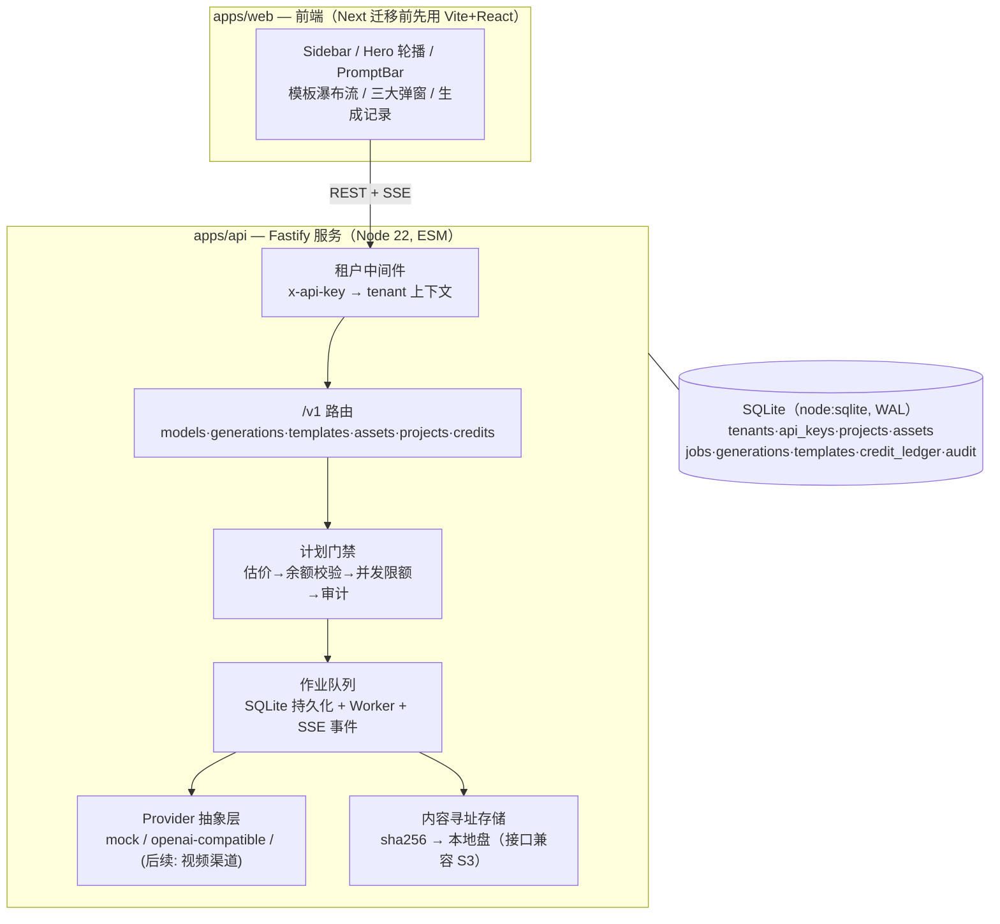

# 营销工作室（Marketing Studio）自研重构方案

> 目标：以 Higgsfield Marketing Studio 为 UI/UX 蓝本、以 Hypit 的**公开架构思想**为设计参考，**100% 自研**一个独立的多租户 Web 营销工作室。本仓库不包含 Hypit 的任何代码，不依赖其发行包，不构成其许可证定义下的"衍生作品"。

---

## 0. 合规红线（本项目一切实现的边界）

| 边界 | 处理方式 |
|---|---|
| **Hypit 代码** | 零复制、零依赖、零衍生。只吸收其**公开文档与 README 中阐述的架构思想**（依赖图执行、内容寻址工件、plan-then-build 预算门禁、词锚定时间、Model/Provider/Endpoint 三层解耦）——思想与模式不受版权保护，全部实现代码独立编写 |
| **Higgsfield 资产** | 复刻的是**布局、交互范式与信息架构**（行业通用做法）；不使用其任何图片、字体文件、logo、品牌名与原文文案。本仓库所有占位素材均为运行时程序化生成 |
| **多租户授权** | Hypit 的商业授权条款只约束"其代码的使用"。自研实现不受其约束，多租户能力完全自建 |
| **模型渠道 ToS** | 接入第三方生成渠道时逐渠道核对商用条款（生成内容权利、速率、数据留存） |

## 1. 总体架构



**从 Hypit 吸收并独立实现的四个核心思想：**

1. **计划先行（Plan-then-Build）**：提交作业前按"模型单价 × 数量"估价，校验租户余额与并发配额，拒绝时返回 402/429 与解释——把成本控制做成硬门禁而非事后账单；
2. **内容寻址工件**：所有产物以 `sha256` 寻址入库（天然去重、可缓存、可校验完整性），存储驱动可替换（本地盘 ↔ S3）；
3. **Model / Provider / Endpoint 三层解耦**：模型包声明"能吃什么"（端口与参数 schema），Provider 实现"怎么调"（渠道协议），Endpoint 是"配置实例"（地址+凭据+定价+并发）。前端模型选择器直接由 `GET /v1/models` 聚合驱动，新增渠道零前端改动；
4. **作业状态机**：`queued → running(progress events) → succeeded/failed`，事件流经 SSE 推送，持久化于 SQLite，进程重启可恢复。

## 2. 自研多租户设计

| 层面 | 实现 |
|---|---|
| 租户模型 | `tenants`（组织）— `api_keys`（密钥，可轮换/停用）— 用户归属后续接 OAuth/JWT；每个业务行都带 `tenant_id`，**所有查询强制租户过滤**（中间件注入上下文，路由层不允许裸查询） |
| 凭据 | `x-api-key` 头 → 中间件解析 → `req.tenant`；密钥哈希存储、支持 `disabledAt` 停用 |
| 隔离 | 数据行级隔离（tenant_id）+ 存储路径前缀隔离（`files/<tenant>/<sha>`）+ 作业并发限额（每租户同时运行任务数上限，超出 429） |
| 计费 | `credit_ledger` 流水账（charge/refund/grant），余额 = SUM；作业成功按实际产出数扣费、失败自动全额退款 |
| 审计 | `audit` 表记录 job.create / asset.upload / credits.charge 等关键动作（谁、何时、对什么、参数摘要） |
| 速率 | 首版：并发限额 + 全局队列；后续加令牌桶按租户限流 |

> 迁移到 Postgres 的路径：schema 全部使用标准 SQL 类型，数据访问集中在 `db.ts` 单文件，替换驱动即可，业务代码零改动。

## 3. API 契约（/v1，全部要求 x-api-key）

```
GET  /v1/models?kind=image|video          模型目录（含积分单价/参数枚举）
POST /v1/generations                      创建作业 {kind,model,prompt,params{aspectRatio,resolution,duration,count,references[]}}
GET  /v1/generations?kind=&status=        作业+产物列表
GET  /v1/generations/:id                  详情
GET  /v1/generations/:id/events           SSE 进度流（percent/status/generations）
POST /v1/generations/:id/favorite         收藏 / DELETE 取消
GET  /v1/templates?category=&kind=        模板目录
POST /v1/templates/:id/recreate           模板复刻 {productAssetId,avatarAssetId,edit,count}
POST /v1/assets                           multipart 上传（产品图/头像/参考视频）
GET  /v1/assets/file/:hash.:ext           工件读取
GET  /v1/assets/placeholder               程序化占位图（开发期素材，SVG）
GET  /v1/credits                          余额 + 流水
GET/POST /v1/projects                     项目列表/新建
```

## 4. 前端信息架构（对照 Higgsfield 五张截图的复刻映射）

| 截图 | 复刻组件 | 状态接线 |
|---|---|---|
| ① 首页（Image 模式） | `Sidebar` + `HeroCarousel`（扇形叠卡轮播）+ `PromptBar`（图/视频切换、模型选择、画幅、数量、AVATAR/PRODUCT 参考位、GENERATE 徽标含预估积分）+ `TemplateGrid`（分类 chips + 瀑布流） | models/templates/credits 实时来自 API；GENERATE 点击 → POST generations → 跳转生成记录页 |
| ② Recreate 模板弹窗 | `RecreateModal`：左图右表单（上传产品=必填 / 选择头像=可选 / 编辑描述 / 复刻 ✦N） | POST /templates/:id/recreate |
| ③ Ad Reference 弹窗 | `AdReferenceModal`：上传参考视频 + PRODUCT/AVATAR chips + CONTINUE | 创建视频作业（P4 前用规则化提示词；LLM 编排接入点已预留 `POST /v1/agents/analyze`） |
| ④ Product Link 弹窗 | `ProductLinkModal`：商品链接输入 + CONTINUE | 创建视频作业（同上，抓取器为 P4） |
| ⑤ 视频（Video 模式） | PromptBar 视频态：模型（Seedance 类）、References、画幅 16:9、分辨率 1080p、时长 15s、积分预览 | 同一组件不同 kind 的参数 schema |

## 5. 里程碑

| 里程碑 | 内容 | 本仓库状态 |
|---|---|---|
| **M0** | 方案 + monorepo 骨架 + 合规边界 | ✅ |
| **M1** | 后端 MVP：多租户 + 模型目录 + 作业队列 + mock Provider 端到端 + SSE | ✅ |
| **M2** | 前端 MVP：首页/生成记录全交互复刻 + 三大弹窗接线 | ✅ |
| **M3** | 真实模型接入：`openai-images`（OpenAI 兼容渠道）+ **异步任务协议视频渠道适配器**（submit/poll/download，Seedance 类）+ `apps/mock-channel` 协议模拟器 | ✅ 已验证：经 mock 渠道全链路产出 h264 MP4；配 env 即接真实渠道 |
| **M4** | **自研词锚定渲染引擎**：词级对齐器（synthetic + SRT，ASR 端口预留）→ 语义时间轴（场景/字幕 Cue/词锚点）→ 逐帧 SVG 合成（卡拉OK当前词高亮、场景调色、结束卡）→ resvg 栅格化 → FFmpeg libx264 编码 | ✅ 已验证：`studio-render-v1` 产出真实 MP4（h264/30fps/词级时间精确） |
| **M6** | **Agentic 管线**：`POST /v1/agents/ad-reference`（参考视频 → ffmpeg 静音检测提取节奏骨架[节拍数/时长] → 可选 ASR/手抄台词 → Composer 生成脚本[LLM 渠道或语法安全的规则改写，按参考节拍词数选模板变体] → M4 引擎渲染）；`POST /v1/agents/product-link`（商品页抓取 → OG/JSON-LD 提取标题/描述/价格/主图 → 主图自动入库为参考 → 脚本 → 渲染）；作业崩溃恢复（running→queued 重入队） | ✅ 已验证：参考片节奏 3 节拍/8s 精确克隆为 MP4（8.000s）；fixture 商品页全链路成片（10.000s）；og:image 自动入库；恢复机制实测 |
| **P1** | **吸收 Hypit 的 Agent 一等公民机制（全部自研实现，未复制任何代码/文本）**：① `POST /v1/plan` 干跑估价（复用节奏分析与 Composer 真实预演，直接生成/模板/agent 三形态，plan 报价与实际扣费同源）；② 自动 QC（ffprobe 可读性/时长±0.6s/黑帧/最小体积）+ 失败自动重渲一次 + 人工 approve/reject 验收流 + reject 后免费重渲一次（幂等 409）；③ `skills/maker-studio/`（SKILL.md + 8 篇参考 + 问题→文档路由表，平文件双入口 `.claude/` `.codex/` + 同步脚本防漂移） | ✅ 已验证：plan 四形态、QC passed、approve/reject、免费重渲 0 扣费、409 幂等 |
| **P2** | **Credential Store + 租户级 BYOK**：`credentials` 表（AES-256-GCM 密文，主密钥 `STUDIO_MASTER_KEY`，明文永不出 API）；`endpoints` 表（租户自有渠道，只存 `credentialRef` 引用）；模型解析从全局单例改为**按租户解析**（租户 BYOK 端点优先，名称与内置模型防碰撞）；BYOK 默认 0 积分计价；Web Integrations 弹窗（加渠道→模型选择器即时出现） | ✅ 已验证：租户隔离（beta 看不到 alpha 渠道）、BYOK 生成成功且 0 扣费、密文/引用不出 API、凭据落库加密存储 |

## 6. 启动方式

```bash
pnpm install
pnpm dev:api        # http://127.0.0.1:8787（mock Provider，开箱即用）
pnpm dev:web        # http://127.0.0.1:5273
```

演示租户密钥（多租户演示用，生产必须替换）：`sk_demo_alpha` / `sk_demo_beta`（余额与数据完全隔离）。

真实模型接入：复制 `.env.example` → `.env`，填 `STUDIO_OPENAI_BASE_URL / STUDIO_OPENAI_API_KEY / STUDIO_OPENAI_IMAGE_MODEL`（任何 OpenAI images 协议兼容渠道），重启后 `GET /v1/models` 自动出现新模型。
